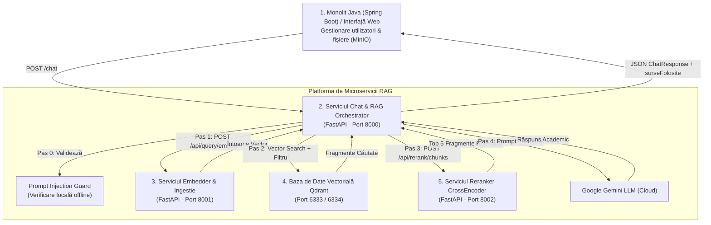

# Documentație Platformă Sistem RAG & Chat Academic

## 1. Ce este și ce face acest sistem?

Sistemul este o platformă integrată de **Asistent Academic Inteligent de tip RAG (Retrieval-Augmented Generation)** dezvoltat pentru un mediu educațional universitar. Scopul său este să le le ofere studenților răspunsuri instante, precise și fundamentate pe suporturile de curs furnizate de profesori.

### Beneficiile și Funcționalitățile Cheie:
1. **Eliminarea Halucinațiilor AI (Strict Grounding)**:  
   Modelul de Inteligență Artificială (Google Gemini) generează răspunsuri **exclusiv pe baza documentelor de curs reale** încărcate de profesori (PDF/Word), nepermițând speculații sau cunoștințe exterioare nevalidate.
2. **Izolarea Cunoștințelor pe Săptămâni (Knowledge Isolation)**:  
   Sistemul aplică un filtru strict de securitate bazat pe progresul semestrial al studentului. Dacă un student este în **Săptămâna 3**, asistentul **refuză să ofere informații din Săptămânile 4 sau 5**, chiar dacă studentul întreabă direct despre ele.
3. **Scut de Securitate AI (Prompt Injection Guard)**:  
   Detectează și blochează automat tentativele de manipulare ale sistemului de AI (atacuri de tip Jailbreak / Prompt Injection).
4. **Căutare Semantică & Reclasificare Duală (Reranking)**:  
   Utilizează un model de embeddings (`BAAI/bge-m3`) și o bază de date vectorială (Qdrant), urmată de o reclasificare de mare precizie prin modelul CrossEncoder (`mmarco-mMiniLMv2`).
5. **Trasabilitatea Surselor**:  
   Fiecare răspuns este însoțit de lista de ID-uri ale documentelor utilizate (`surseFolosite`), oferind transparență și posibilitatea verificării.

---

## 2. Arhitectura Generală a Sistemului

Proiectul este structurat sub formă de **microservicii modulare containerizate** care comunică prin interfețe REST:



### Componentele și Rolurile lor:

* **Monolitul Backend (Spring Boot + MinIO)**: Aplicația web principală. Gestionează autentificarea, rolurile (student/profesor), cursurile și stochează fișierele originale în MinIO.
* **Serviciul de Chat & RAG Orchestrator (FastAPI - Port 8000)**: Serviciul central care orchestrează cererea: validează securitatea, solicită vectorizarea întrebării, interoghează Qdrant, trimite fragmentele la Reranker, formulează promptul academic și generează răspunsul final prin Gemini.
* **Serviciul de Embedder & Ingestie (FastAPI - Port 8001)**: Prelucrează documentele (chunking & embeddings cu `BAAI/bge-m3`), le salvează în Qdrant și oferă endpoint-ul `POST /api/query/embed` pentru vectorizarea întrebărilor în timp real.
* **Serviciul de Reranker (FastAPI + CrossEncoder - Port 8002)**: Reclasifică fragmentele returnate de căutarea vectorială folosind modelul `mmarco-mMiniLMv2`, asigurând selectarea celor mai relevante 5 propoziții.
* **Baza de Date Vectorială (Qdrant - Port 6333)**: Stochează vectorii fragmentelor de text și metadatele aferente (`course_id`, `week_id`), permițând interogări semantice rapide cu filtre strict aplicate.

---

## 3. Structura Proiectului

```
llm-response-service/
├── main.py                   # Punctul de intrare FastAPI pentru Serviciul de Chat
├── models.py                 # Schemele Pydantic ale API-ului (ChatRequest, ChatResponse)
├── security_guard.py         # Filtru anti-Prompt Injection & Jailbreak
├── retrieval_service.py      # Integrare Embedder & Qdrant Vector Search cu fallback
├── reranker_service.py       # Client HTTP pentru serviciul Reranker (Port 8002)
├── prompt_builder.py         # Formator de prompt-uri cu instrucțiuni academice
├── llm_service.py            # Client pentru API-ul Google Gemini
├── docker-compose.yml        # Orchestrarea containerelor pentru întregul sistem RAG
├── Dockerfile                # Configurare container Docker pentru Serviciul de Chat
│
├── embedder_service/         # Microserviciul de Ingestie & Embeddings (Port 8001)
│   ├── Dockerfile
│   └── fastapi_app/          # Cod sursă FastAPI pentru vectorizare și MinIO/Qdrant
│
└── reranker-service/         # Microserviciul CrossEncoder Reranker (Port 8002)
    ├── Dockerfile
    └── main.py               # Model CrossEncoder mmarco-mMiniLMv2
```

---

## 4. Instrucțiuni de Pornire & Testare

### Rulare prin Docker Compose (Toate Serviciile):
```powershell
cd llm-response-service

# 1. Configurați mediul
copy .env.example .env

# 2. Porniți toate microserviciile
docker compose up --build
```

Interfețe Swagger & Dashboard-uri disponibile:
- **Chat Orchestrator API**: `http://localhost:8000/docs`
- **Embedder Service API**: `http://localhost:8001/docs`
- **Reranker Service API**: `http://localhost:8002/docs`
- **Qdrant Dashboard**: `http://localhost:6333/dashboard`
