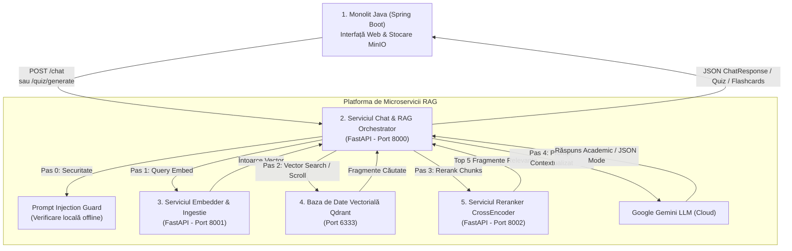

# Documentație Platformă Sistem RAG & Chat Academic

## 1. Ce este și ce face acest sistem?

Sistemul este o platformă integrată de **Asistent Academic Inteligent de tip RAG (Retrieval-Augmented Generation)** dezvoltat pentru un mediu educațional universitar. Scopul său este să le ofere studenților răspunsuri instante, precise și fundamentate pe suporturile de curs furnizate de profesori, precum și generarea de chestionare de evaluare și fișe de memorare.

### Beneficiile și Funcționalitățile Cheie:
1. **Eliminarea Halucinațiilor AI (Strict Grounding)**:  
   Modelul de Inteligență Artificială (Google Gemini) generează răspunsuri **exclusiv pe baza documentelor de curs reale** încărcate de profesori (PDF/Word), nepermițând speculații sau cunoștințe exterioare nevalidate.
2. **Izolarea Cunoștințelor pe Săptămâni (Knowledge Isolation)**:  
   Sistemul aplică un filtru strict de securitate bazat pe progresul semestrial al studentului. Dacă un student este în **Săptămâna 3**, asistentul **refuză să ofere informații din Săptămânile 4 sau 5**, chiar dacă studentul întreabă direct despre ele.
3. **Generare de Quiz-uri & Flashcards (Nou)**:  
   Permite generarea automată de chestionare multiple-choice (cu răspunsuri corecte și explicații) și fișe de studiu concept-definiție pe baza materialelor accesibile studentului, oferind un flux de sanitizare pe backend (răspunsurile corecte sunt ascunse la generare în DevTools și evaluate doar pe server la finalizare).
4. **Scut de Securitate AI (Prompt Injection Guard)**:  
   Detectează și blokează automat tentativele de manipulare ale sistemului de AI (atacuri de tip Jailbreak / Prompt Injection) înainte de a interoga API-ul Gemini.
5. **Căutare Semantică & Reclasificare Duală (Reranking)**:  
   Utilizează un model de embeddings (`BAAI/bge-m3`) și o bază de date vectorială (Qdrant), urmată de o reclasificare de mare precizie prin modelul CrossEncoder (`mmarco-mMiniLMv2`).
6. **Trasabilitatea Surselor**:  
   Fiecare răspuns este însoțit de lista de ID-uri ale documentelor utilizate ca sursă (`surseFolosite`), oferind transparență totală.

---

## 2. Arhitectura Generală a Sistemului

Proiectul este structurat sub formă de **microservicii modulare containerizate** care comunică prin interfețe REST securizate prin Basic Auth:



### Componentele și Rolurile lor:

* **Monolitul Backend (Spring Boot + MinIO)**: Gestionează utilizatorii, sesiunile Keycloak, înrolările la cursuri și fișierele stocate în MinIO. Coordonează permisiunile studenților și asigura sanitizarea cheilor de răspuns la quiz-uri.
* **Serviciul de Chat & RAG Orchestrator (FastAPI - Port 8000)**: Serviciul central care orchestrează fluxul de interogare (chat) și generare de materiale. Validează întrebarea prin Prompt Injection Guard, extrage contexte din Qdrant, le trimite la Reranker (doar la chat), construiește prompturile cu grounding și generează rezultatul prin Gemini.
* **Serviciul de Embedder & Ingestie (FastAPI - Port 8001)**: Extrage textul din PDF (utilizând Apache Tika pe Spring Boot pentru validarea tipurilor de fișiere) și imagini (captioning asincron cu Gemini Vision), creează chunks & embeddings folosind `BAAI/bge-m3` și le încarcă în Qdrant.
* **Serviciul de Reranker (FastAPI + CrossEncoder - Port 8002)**: Reordonează fragmentele vectoriale pe baza relevanței directe față de întrebare folosind modelul `mmarco-mMiniLMv2`.
* **Baza de Date Vectorială (Qdrant - Port 6333)**: Stochează vectorii și metadatele aferente, permițând căutări vectoriale rapide filtrate după `cursId` și `saptamanaId`.

---

## 3. Structura Proiectului

```
rag/
├── compose.yaml              # Orchestrarea Docker pentru întregul sistem RAG
│
├── llm-response/             # Serviciul de Chat & LLM Response (Port 8000)
│   ├── app/
│   │   ├── main.py           # Punct de intrare FastAPI, routere chat, quiz și flashcards
│   │   ├── core.py           # Modele Pydantic și funcții de prompt builder
│   │   ├── services.py       # Integrare Qdrant client, LLM Gemini și apeluri Reranker
│   │   └── auth.py           # Securitate Basic Auth & Middleware context
│   └── Dockerfile
│
├── embedder/                 # Microserviciul de Ingestie & Embeddings (Port 8001)
│   ├── fastapi_app/
│   │   ├── main.py           # Ingestion router (POST /documents/ingest)
│   │   ├── routes/           # Rutare pentru query, documente și health checks
│   │   └── services/         # Modele BGE-m3 și conexiune Qdrant
│   └── Dockerfile.multistage
│
└── reranker/                 # Microserviciul CrossEncoder Reranker (Port 8002)
    ├── main.py               # Predictie cu modelul CrossEncoder
    └── Dockerfile.multistage
```

---

## 4. Instrucțiuni de Pornire & Testare

### Rulare prin Docker Compose (Toate Serviciile RAG):
```powershell
# Accesați folderul principal al sistemului RAG
cd rag

# 1. Configurați cheia API Gemini în .env din subdirectorul llm-response
copy llm-response/.env.example llm-response/.env

# 2. Porniți containerele serviciilor RAG
docker compose up --build
```

Interfețe Swagger & Dashboard-uri disponibile:
- **Chat Orchestrator API**: `http://localhost:8000/docs`
- **Embedder Service API**: `http://localhost:8001/docs`
- **Reranker Service API**: `http://localhost:8002/docs`
- **Qdrant Dashboard**: `http://localhost:6333/dashboard`

